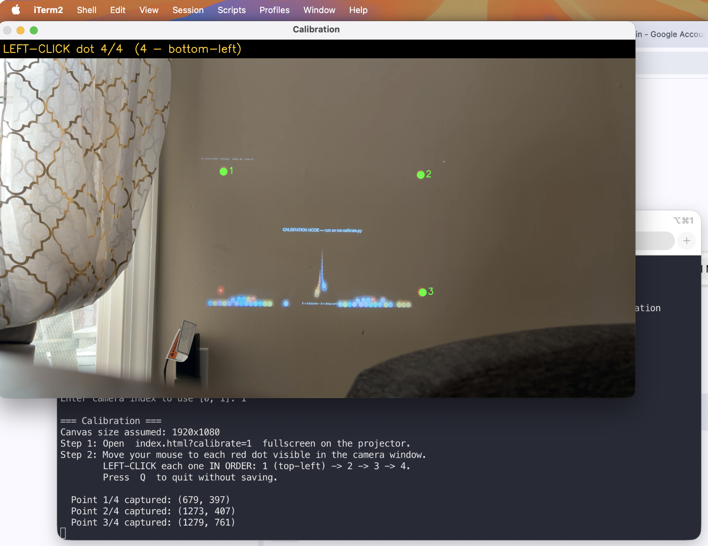

# StickyBounce

A mixed reality wall game where digital balls fall from the top of a projected screen and bounce off **real sticky notes** you stick on the wall.

A projector displays the game on the wall. A camera watches the wall. When you place a sticky note, the computer detects it and adds a physics collider — so the next ball that falls will bounce right off it.

Built as a fun activity for kids.

https://github.com/user-attachments/assets/stickyBounce-demo.mp4

---

## How it works

```
Webcam (iPhone)
     │
     ▼
Python + OpenCV  ──── detects yellow sticky notes (position + angle)
     │
     │  WebSocket (JSON)
     ▼
Browser + Matter.js  ──── physics simulation + rendering
     │
     ▼
Projector  ──── displays the game on the wall
```

1. A Python script captures the webcam feed and detects yellow sticky notes using color detection (HSV thresholding)
2. Detected note positions and angles are sent to the browser over a local WebSocket
3. The browser runs a physics simulation (Matter.js) — each sticky note becomes a static rigid body
4. Colorful balls spawn from the top and fall under gravity, deflecting off the notes
5. The browser window is projected onto the wall fullscreen

---

## Hardware required

- A computer (tested on macOS)
- A projector pointed at a plain wall
- A camera pointed at the wall (tested with iPhone via Continuity Camera)
- **Yellow sticky notes** (other bright colors work too — see Tuning below)

---

## Setup

**1. Install [uv](https://docs.astral.sh/uv/getting-started/installation/) if you don't have it:**
```bash
curl -LsSf https://astral.sh/uv/install.sh | sh
```

**2. Clone the repo and install dependencies:**
```bash
git clone <repo-url>
cd ball-falling
uv sync
```

---

## iPhone as webcam (macOS)

1. On iPhone: **Settings → General → AirPlay & Handoff → Continuity Camera Webcam → ON**
2. Connect iPhone via USB-C and tap **Trust** if prompted
3. iPhone will appear as a camera (index `1`) on your Mac

---

## Calibration (one time)

Calibration maps the camera's view of the wall to the game's screen coordinates so detected notes land in the right place.

**Step 1:** Open `index.html?calibrate=1` in your browser, fullscreen it on the projector display. Four numbered red dots will appear at the corners of the screen.

**Step 2:** Run the calibration tool:
```bash
uv run calibrate.py
```

**Step 3:** In the camera window that opens, **left-click each red dot in order** (1 → 2 → 3 → 4) as you see them projected on the wall.



Calibration is saved to `calibration.npz` and loaded automatically from then on.

---

## Running the game

**Terminal:**
```bash
uv run server.py
```

**Browser:** Open `index.html`, fullscreen it on the projector (**F** key or Cmd+Shift+F).

Balls will start falling from the top. Stick yellow post-its on the wall and watch them deflect!

---

## Keyboard shortcuts

| Key | Action |
|-----|--------|
| `F` | Toggle fullscreen |
| `D` | Toggle debug outlines (shows detected note boundaries in red) |

---

## Tuning & troubleshooting

### Notes not being detected?

Run the tuning tool to check detection live:
```bash
uv run tune.py
```
Hold a sticky note in front of the camera — it should turn **cyan**. If it doesn't, your notes are a different shade. Open `server.py` and `tune.py` and adjust these values at the top:

```python
PINK_LOWER_1 = np.array([18,  80,  80])   # H_min, S_min, V_min
PINK_UPPER_1 = np.array([35, 255, 255])   # H_max, S_max, V_max
```

HSV hue reference (OpenCV uses 0–180):

| Color  | H range |
|--------|---------|
| Yellow | 18–35   |
| Orange | 8–18    |
| Pink   | 145–180 + 0–10 |
| Green  | 35–85   |

### Wrong camera?
```bash
uv run server.py --camera 1   # or 0, 2, etc.
```

---

## Making it more fun

All tweaks are in `index.html`:

| What | Variable | Default | Try |
|------|----------|---------|-----|
| Spawn faster | `SPAWN_INTERVAL_MS` | `1400` | `800` |
| Bouncier balls | `restitution` in `Bodies.circle(...)` | `0.65` | `0.9` |
| Faster falling | `gravity.y` in `Engine.create(...)` | `1.5` | `2.5` |
| Bigger balls | `BALL_RADIUS` | `18` | `28` |
| More balls max | `MAX_BALLS` | `40` | `80` |
| Spawn position | `const x = W / 2` | center | `W * 0.3` |

---

## Tech stack

- **Python** — OpenCV (color detection), websockets
- **JavaScript** — Matter.js (physics), Canvas (rendering)
- **uv** — Python package manager
